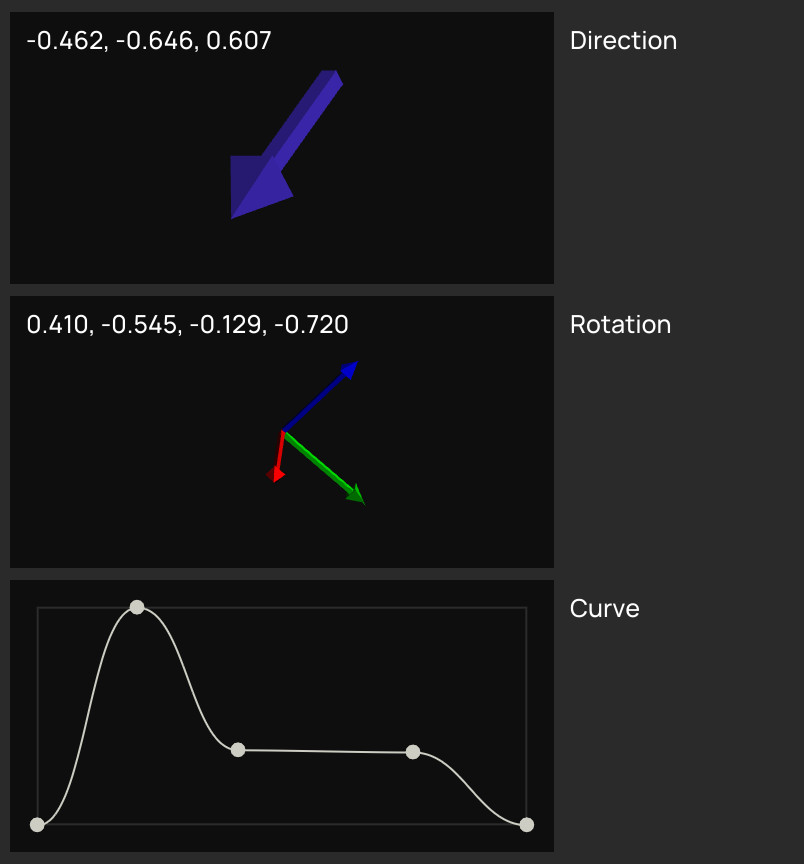

# napgizmo
NAP module that adds various handy gizmo controls. May grow into a more comprehensive collection of utilities or get divided up in separate modules.



## Widgets
- Direction (adds `nap::ParameterDirection` and parameter editor)
- Orientation (overrides parameter editor for `nap::ParameterQuat`)
- FloatFCurve (adds `nap::ParameterFloatFCurve` and parameter editor)

## Build
- Make sure to clone the `napframework/nap` repository and checkout the `0.8` branch.
- Clone the `napgizmo` repository into the `modules` directory of the NAP source root.
- Run `tools/setup_module.sh napgizmo` to add it to the solution.
- Now, the `solution_info.json` should look something like this: 
```
{
    "Type": "nap::SolutionInfo",
    "mID": "SolutionInfo",
    "AdditionalTargets": [
        "modules/napgizmo"
    ]
}
```

Open a terminal and run `generate_solution.bat` or `sh generate_solution.sh` to generate the solution for your platform. This application is only compatible 
with NAP 0.8 mentioned above, and should be built from source, not package.
